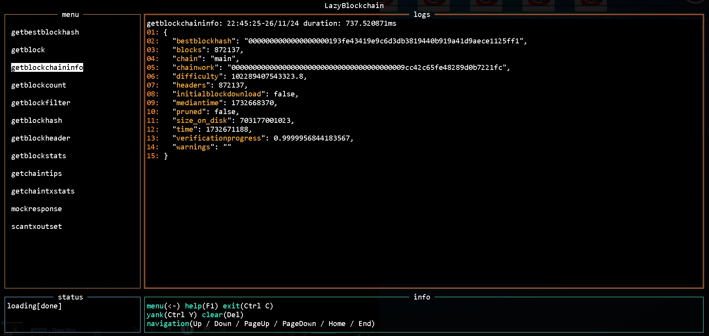

# LazyBlockchain

LazyBlockchain is a **Command-Line Interface (CLI) Terminal User Interface (TUI) application** designed to interact seamlessly with Bitcoin nodes. It allows users to send JSON-RPC commands and view blockchain data in an intuitive and interactive terminal-based interface.



---

## Features

- **Command-Line Options**:
  - `--host="<node_ip>"`
  - `--port="<node_port(default: 8332)>"`
  - `--user="<node_user>"`
  - `--password="<node_password>"`

  If command-line options are not provided `LazyBlockchain` will check for the configuration at `~/.bitcoin/bitcoin.conf`
- **JSON-RPC Integration**:
  - Supports all JSON-RPC methods exposed by Bitcoin nodes, such as:
    - `getblockchaininfo`
    - `getblockhash`
    - `getchaintips`
    - and more!
- **Interactive TUI**:
  - A terminal interface for real-time interaction and visualization.
  - Displays logs and results in a clean and navigable UI.
  - Shortcuts for working with JSON.


---

## Installation

### Prerequisites
- [Go](https://go.dev/) 1.21.5 or higher
- A running Bitcoin node with RPC enabled (e.g., Bitcoin Core).

### Clone the Repository
```bash
git clone https://github.com/nicholasinatel/lazyblockchain.git
cd lazyblockchain
```

### Running
```bash
make run
```

> Check: make help

---

### Debugging

VSCode launch.json example for debugging:
```json
{
    "version": "0.2.0",
    "configurations": [
        {
            "name": "lazyblockchain",
            "type": "go",
            "request": "launch",
            "mode": "auto",
            "program": "${workspaceFolder}",
                        "args": [
                            "--host", "***.***.***.***",
                            "--port", "***",
                            "--user", "***",
                            "--password", "***"
                        ],
            "console": "integratedTerminal"
        }
    ]
}
```

> Check: make help

---

### Developer's help

VSCode launch.json example for debugging:
```json
{
    "version": "0.2.0",
    "configurations": [
        {
            "name": "lazyblockchain",
            "type": "go",
            "request": "launch",
            "mode": "auto",
            "program": "${workspaceFolder}",
                        "args": [
                            "--host", "***.***.***.***",
                            "--port", "***",
                            "--user", "***",
                            "--password", "***"
                        ],
            "console": "integratedTerminal"
        }
    ]
}
```
### Contributing
Contributions welcome! Please fork the repository and create a pull request for any new features or bug fixes.
Try to follow Go's best practices.

### License
I still need to read about this, but this stuff is free!

### Acknowledgments
[Bitcoin](https://bitcoincore.org) Core for its robust JSON-RPC API.
[tview](https://github.com/rivo/tview) for creating the TUI components.
[tcell](https://github.com/gdamore/tcell) for being awesome.
The Go community for its fantastic libraries and support.
